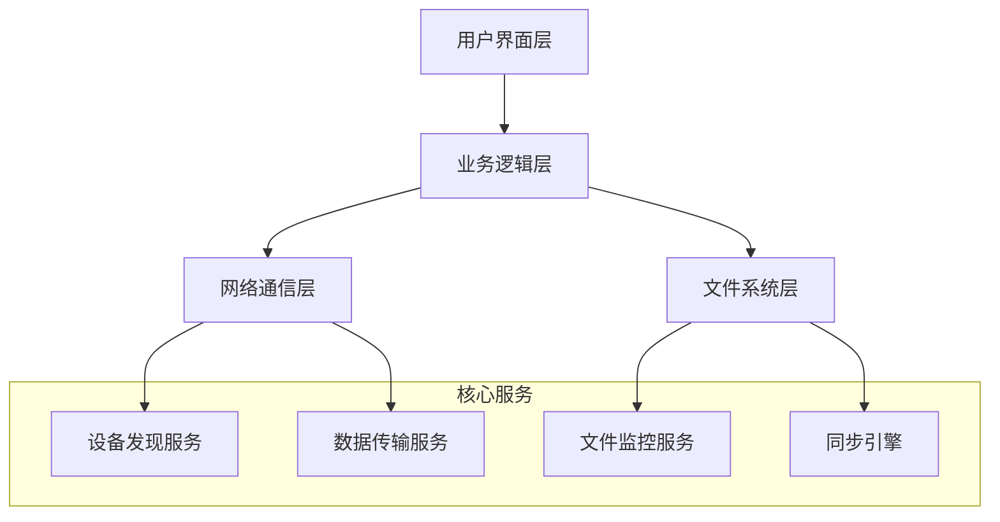
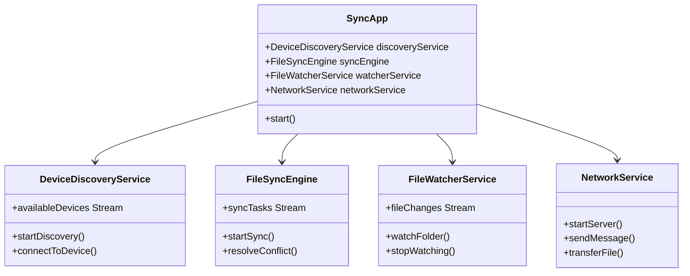
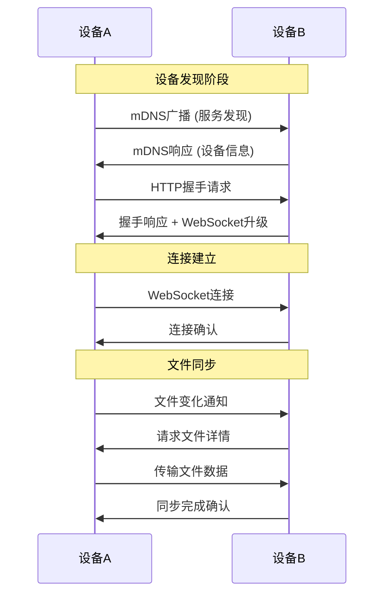
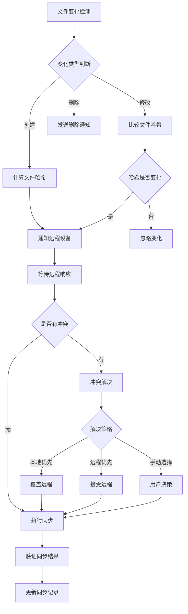
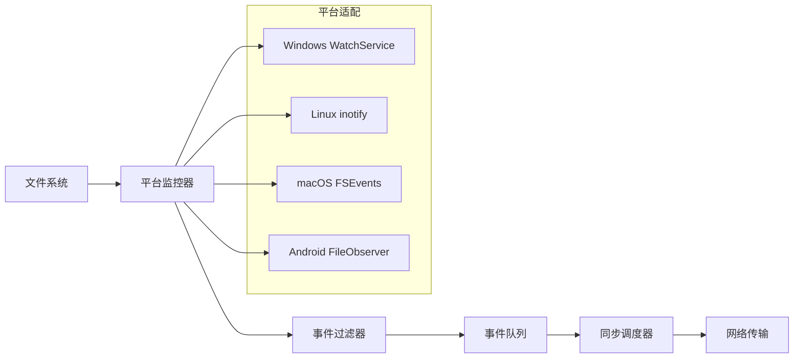
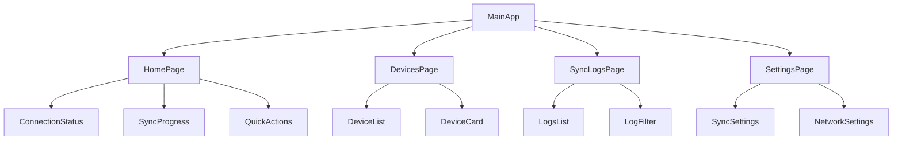
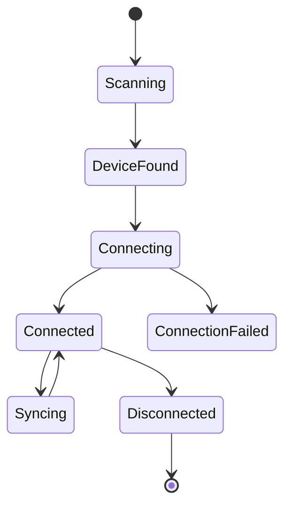
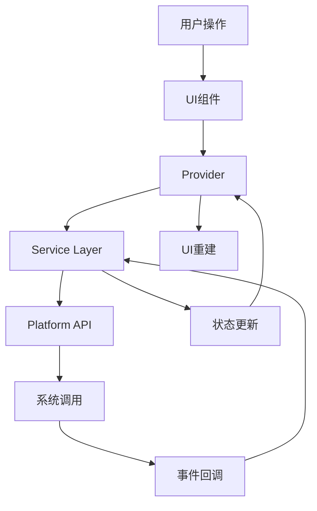
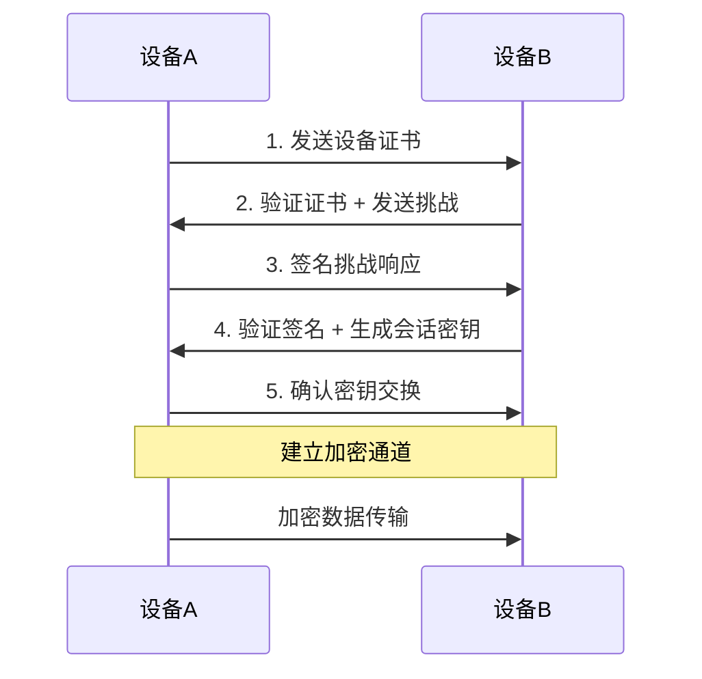

# 跨平台局域网文件同步应用设计文档

## 概述

基于Flutter框架开发的跨平台文件同步应用，支持Windows、Android、macOS和Linux系统。实现局域网内多设备间文件夹实时双向同步，确保连接的设备拥有完全一致的文件夹结构和内容。

### 核心特性
- 跨平台支持（Windows、Android、macOS、Linux）
- 局域网设备自动发现
- 实时文件变化监控
- 双向文件同步
- 冲突解决机制
- 安全传输加密

## 技术栈与依赖

### Flutter核心框架
- **Flutter SDK**: ^3.9.0
- **Dart**: ^3.0.0

### 网络通信组件
- **shelf**: HTTP服务器框架
- **http**: HTTP客户端
- **web_socket_channel**: WebSocket通信
- **multicast_dns**: 设备发现服务

### 文件系统操作
- **path_provider**: 获取系统路径
- **file_picker**: 文件选择器
- **permission_handler**: 权限管理
- **watcher**: 文件变化监控

### 加密与安全
- **crypto**: 文件哈希计算
- **encrypt**: 数据加密传输

### 平台特定依赖
- **desktop_window**: 桌面窗口管理
- **android_intent**: Android系统集成

## 架构设计

### 整体架构



### 分层架构详情

#### 1. 用户界面层 (UI Layer)
负责用户交互和界面展示

**主要组件:**
- **主页面**: 显示连接状态、同步状态
- **设备列表**: 显示发现的局域网设备
- **文件夹选择**: 选择要同步的本地文件夹
- **同步日志**: 显示同步历史和错误信息
- **设置页面**: 配置同步规则和网络参数

#### 2. 业务逻辑层 (Business Layer)
处理应用核心业务逻辑

**服务管理器:**
- 设备连接管理
- 同步任务调度
- 冲突解决策略
- 用户设置管理

#### 3. 网络通信层 (Network Layer)
处理设备间通信

**设备发现服务:**
- 使用mDNS进行设备广播和发现
- 维护活跃设备列表
- 处理设备连接状态变化

**数据传输服务:**
- HTTP/WebSocket双协议支持
- 文件分块传输
- 断点续传机制
- 传输进度跟踪

#### 4. 文件系统层 (File System Layer)
管理本地文件操作

**文件监控服务:**
- 监控目标文件夹变化
- 检测文件创建、修改、删除
- 生成变化事件队列

**同步引擎:**
- 文件差异比较
- 同步任务执行
- 冲突检测和解决
- 文件完整性验证

## 组件架构

### 核心组件定义

#### 1. DeviceDiscoveryService
设备发现和连接管理服务

```dart
class DeviceDiscoveryService {
  // 设备信息模型
  class DeviceInfo {
    String deviceId;
    String deviceName;
    String ipAddress;
    int port;
    DateTime lastSeen;
    DeviceStatus status;
  }
  
  // 核心方法
  Future<void> startDiscovery();
  Future<void> stopDiscovery();
  Stream<List<DeviceInfo>> get availableDevices;
  Future<bool> connectToDevice(String deviceId);
}
```

#### 2. FileSyncEngine
文件同步核心引擎

```dart
class FileSyncEngine {
  // 同步任务模型
  class SyncTask {
    String taskId;
    String sourceDeviceId;
    String targetDeviceId;
    String filePath;
    SyncOperation operation;
    TaskStatus status;
  }
  
  // 核心方法
  Future<void> startSync(String folderPath);
  Future<void> pauseSync();
  Stream<SyncTask> get syncTasks;
  Future<void> resolveConflict(String fileId, ConflictResolution resolution);
}
```

#### 3. FileWatcherService
文件变化监控服务

```dart
class FileWatcherService {
  // 文件变化事件
  class FileChangeEvent {
    String filePath;
    ChangeType type; // CREATE, MODIFY, DELETE
    DateTime timestamp;
    String fileHash;
  }
  
  // 核心方法
  Future<void> watchFolder(String folderPath);
  Stream<FileChangeEvent> get fileChanges;
  Future<void> stopWatching();
}
```

#### 4. NetworkService
网络通信服务

```dart
class NetworkService {
  // 消息模型
  class SyncMessage {
    String messageId;
    MessageType type;
    String sourceDeviceId;
    Map<String, dynamic> payload;
  }
  
  // 核心方法
  Future<void> startServer(int port);
  Future<bool> sendMessage(String deviceId, SyncMessage message);
  Stream<SyncMessage> get incomingMessages;
  Future<void> transferFile(String deviceId, String filePath);
}
```

### 组件层次关系



## 数据模型设计

### 核心数据模型

#### 设备信息模型
```dart
class DeviceInfo {
  final String deviceId;        // 唯一设备标识
  final String deviceName;      // 设备显示名称
  final String ipAddress;       // IP地址
  final int port;              // 通信端口
  final DeviceType type;       // 设备类型
  final DateTime lastSeen;     // 最后发现时间
  final DeviceStatus status;   // 连接状态
}

enum DeviceType { android, windows, macos, linux }
enum DeviceStatus { available, connected, syncing, offline }
```

#### 文件同步模型
```dart
class FileMetadata {
  final String filePath;       // 文件路径
  final String fileHash;       // 文件哈希值
  final int fileSize;          // 文件大小
  final DateTime modifiedTime; // 修改时间
  final FileType type;         // 文件类型
}

class SyncRecord {
  final String recordId;       // 同步记录ID
  final String sourceDevice;   // 源设备ID
  final String targetDevice;   // 目标设备ID
  final String filePath;       // 文件路径
  final SyncOperation operation; // 操作类型
  final DateTime timestamp;    // 同步时间
  final SyncStatus status;     // 同步状态
}

enum SyncOperation { create, update, delete }
enum SyncStatus { pending, inProgress, completed, failed, conflict }
```

#### 冲突解决模型
```dart
class ConflictInfo {
  final String fileId;         // 文件标识
  final String filePath;       // 文件路径
  final FileVersion local;     // 本地版本
  final FileVersion remote;    // 远程版本
  final ConflictType type;     // 冲突类型
  final DateTime detectedAt;   // 检测时间
}

class FileVersion {
  final String deviceId;       // 设备ID
  final DateTime modifiedTime; // 修改时间
  final String hash;           // 文件哈希
  final int size;              // 文件大小
}

enum ConflictType { 
  modifyModify,    // 双方都修改
  deleteModify,    // 一方删除一方修改
  createCreate     // 双方都创建
}
```

## 网络通信协议

### 通信架构



### 消息协议定义

#### 基础消息格式
```json
{
  "messageId": "uuid",
  "type": "message_type",
  "timestamp": "2024-01-01T00:00:00Z",
  "sourceDeviceId": "device_uuid",
  "targetDeviceId": "device_uuid",
  "payload": {}
}
```

#### 消息类型定义

**设备发现消息**
```json
{
  "type": "device_announce",
  "payload": {
    "deviceInfo": {
      "deviceId": "uuid",
      "deviceName": "用户设备",
      "deviceType": "windows",
      "syncFolders": ["folder_path"]
    }
  }
}
```

**文件变化通知**
```json
{
  "type": "file_change",
  "payload": {
    "filePath": "/sync/folder/file.txt",
    "operation": "create|update|delete",
    "fileHash": "sha256_hash",
    "fileSize": 1024,
    "modifiedTime": "2024-01-01T00:00:00Z"
  }
}
```

**同步请求消息**
```json
{
  "type": "sync_request",
  "payload": {
    "filePath": "/sync/folder/file.txt",
    "expectedHash": "sha256_hash",
    "chunkSize": 1048576
  }
}
```

## 同步引擎设计

### 同步流程



### 冲突解决策略

#### 1. 自动解决策略
- **时间戳优先**: 选择修改时间较新的文件
- **大小优先**: 选择文件大小较大的版本
- **设备优先**: 预设某台设备为主设备

#### 2. 手动解决策略
- **并行保存**: 保存两个版本，添加设备后缀
- **用户选择**: 弹出对话框让用户决定
- **忽略冲突**: 暂时跳过，稍后处理

#### 3. 冲突预防机制
- **文件锁定**: 正在传输的文件临时锁定
- **原子操作**: 使用临时文件确保操作完整性
- **版本标记**: 为每次修改添加版本号

## 文件监控机制

### 监控架构



### 监控实现策略

#### 1. 跨平台监控适配
- **Windows**: 使用File System Watcher API
- **Linux**: 利用inotify机制
- **macOS**: 使用FSEvents框架
- **Android**: 基于FileObserver类

#### 2. 事件过滤机制
- **忽略临时文件**: .tmp, .swp等
- **忽略系统文件**: .DS_Store, Thumbs.db等  
- **忽略隐藏文件**: 以.开头的文件
- **大小过滤**: 超大文件需要特殊处理

#### 3. 批量处理优化
- **事件合并**: 短时间内多次修改合并为一次
- **批量传输**: 多个小文件打包传输
- **优先级队列**: 重要文件优先同步

## 用户界面设计

### 界面组件层次



### 主要界面组件

#### 1. 主页面 (HomePage)
**功能组件:**
- 连接状态指示器
- 同步进度显示
- 快速操作按钮
- 最近同步活动

**状态管理:**
```dart
class HomePageState {
  ConnectionStatus connectionStatus;
  SyncProgress currentSync;
  List<DeviceInfo> connectedDevices;
  List<RecentActivity> recentActivities;
}
```

#### 2. 设备页面 (DevicesPage)  
**功能组件:**
- 可用设备列表
- 设备连接状态
- 连接/断开操作
- 设备详细信息

**交互流程:**


#### 3. 同步日志页面 (SyncLogsPage)
**功能组件:**
- 同步历史记录
- 错误日志显示  
- 日志过滤和搜索
- 导出日志功能

#### 4. 设置页面 (SettingsPage)
**配置选项:**
- 同步文件夹选择
- 冲突解决策略
- 网络参数配置
- 同步规则设定

## 状态管理架构

### 状态管理方案

采用Provider + ChangeNotifier模式进行状态管理

#### 1. 全局状态提供者
```dart
class AppStateProvider extends ChangeNotifier {
  DeviceDiscoveryService _discoveryService;
  FileSyncEngine _syncEngine;
  NetworkService _networkService;
  
  // 应用状态
  AppStatus get status;
  List<DeviceInfo> get devices;
  SyncStatus get syncStatus;
  
  // 状态更新方法
  void updateConnectionStatus(ConnectionStatus status);
  void updateSyncProgress(SyncProgress progress);
  void addDevice(DeviceInfo device);
}
```

#### 2. 页面级状态管理
```dart
class DevicesPageProvider extends ChangeNotifier {
  List<DeviceInfo> _availableDevices = [];
  DeviceInfo? _selectedDevice;
  
  List<DeviceInfo> get availableDevices => _availableDevices;
  DeviceInfo? get selectedDevice => _selectedDevice;
  
  void selectDevice(DeviceInfo device);
  void refreshDevices();
}
```

#### 3. 状态数据流



## 安全机制设计

### 安全架构

#### 1. 设备认证机制
- **设备指纹**: 基于硬件信息生成唯一标识
- **密钥交换**: 使用Diffie-Hellman密钥协商
- **会话token**: 临时会话令牌验证

#### 2. 数据传输加密
- **传输加密**: TLS 1.3协议保护
- **文件加密**: AES-256对称加密
- **完整性校验**: SHA-256哈希验证

#### 3. 访问控制
- **文件夹权限**: 限制可访问的文件夹范围
- **操作权限**: 读取、写入、删除权限控制
- **设备信任**: 信任设备白名单机制

### 安全实现方案

#### 连接建立安全流程


## 测试策略

### 测试分层架构

#### 1. 单元测试 (Unit Tests)
**测试范围:**
- 文件哈希计算函数
- 网络消息序列化/反序列化
- 冲突检测算法
- 文件路径处理工具类

**测试工具:**
- Flutter Test框架
- Mockito模拟依赖
- 测试覆盖率工具

#### 2. 集成测试 (Integration Tests)
**测试场景:**
- 设备发现和连接流程
- 文件同步端到端流程
- 网络异常处理
- 大文件传输测试

#### 3. 系统测试 (System Tests)
**测试环境:**
- 多平台兼容性测试
- 网络环境适应性测试
- 性能压力测试
- 安全渗透测试

### 关键测试用例

#### 文件同步测试用例
```dart
testWidgets('文件同步流程测试', (WidgetTester tester) async {
  // 1. 模拟设备连接
  await mockDeviceConnection();
  
  // 2. 创建测试文件
  final testFile = await createTestFile();
  
  // 3. 触发同步
  await triggerSync(testFile.path);
  
  // 4. 验证远程文件
  expect(await verifyRemoteFile(testFile), isTrue);
  
  // 5. 验证文件内容一致性
  expect(await compareFileContents(), isTrue);
});
```

#### 冲突解决测试用例
```dart
test('文件冲突解决测试', () async {
  // 1. 创建冲突场景
  await createConflictScenario();
  
  // 2. 触发冲突检测
  final conflicts = await detectConflicts();
  expect(conflicts.length, equals(1));
  
  // 3. 应用解决策略
  await applyResolution(conflicts.first, ResolutionStrategy.localWins);
  
  // 4. 验证解决结果
  expect(await isConflictResolved(), isTrue);
});
```